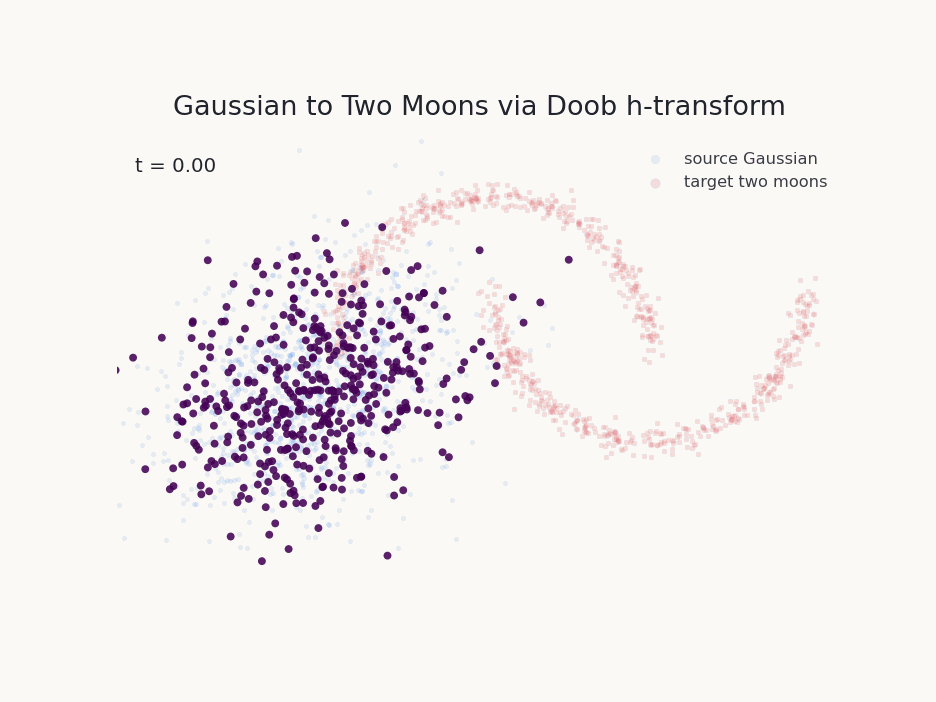

# Schrödinger Bridge Library

A research toolkit of continuous-time Schrödinger Bridges in JAX with multiple solver methods for stochastic transport, generative modeling, and scientific computing. 

<p align="center">
  
</p>

## Features

### Multiple Solver Methods
- **Neural Network Based:**
  - `ScoreBasedSolver`: Denoising score matching (fastest to train)
  - `MalliavinScoreSolver`: BEL/Malliavin weighted score matching
  - `IPFDSBSolver`: DSB-style IPF with forward/backward mean maps
  - `FBSDESolver`: Forward-Backward SDE / stochastic optimal control
  - `IMFSolver`: Iterative Markovian Fitting (simulation-free)
  - `IPFSolver`: Iterative Proportional Fitting with neural parameterization

- **Non-Neural Methods:**
  - `DoobHTransformSolver`: Analytical for Gaussians, kernel-based otherwise
  - `RKHSSolver`: Pure kernel methods (no neural networks)

### Specialized Extensions
- **Marginal Schrödinger Bridge**: Match marginals at multiple intermediate times

### Experimental: Malliavin Adjoint Matching

The `adjoint-matching` branch contains a JAX-first conditional stochastic-control
inner solver for generalized bridge research. It regresses conditional-mean
costate targets from stopped, value-only discrete Malliavin--Bismut/BEL labels.
Equality with the discrete state costate holds only under the assumptions in
the mathematical contract; a finite trained network remains an approximation.
The initial implementation is restricted to constant full-rank diffusion and
endpoint-pinned Brownian conditional paths. The generic EM reference kernel
supports unpinned terminal values. The pinned inner solver rejects configured
terminal costs because a fixed endpoint gives no interior costate contribution.
A pure potential of a fixed target marginal is globally constant; an endpoint-
pair cost, by contrast, must be handled by a future coupling outer loop.

This component is **not yet a complete generalized Schrödinger bridge solver**.
The reciprocal/Markov projection that produces a global bridge while preserving
both endpoint marginals is a separate acceptance gate. See
[`docs/malliavin_adjoint_matching_contract.md`](docs/malliavin_adjoint_matching_contract.md)
for the exact estimator, assumptions, and claim boundary.
The first frozen Gate-A run is recorded in
[`docs/mam_gate_a_results.md`](docs/mam_gate_a_results.md); its analytic BEL
checks passed, but its neural costate regression missed the predeclared gates.

`CONDITIONAL_MAM_FOUNDATION` is a capability tag, not an experimental pass.
Reduced Gate-A runs are smoke tests only; only a scientific run that meets the
predeclared analytic and held-out regression gates may report
`PASS_MAM_ANALYTIC_FOUNDATION`. Neither status establishes policy improvement,
equivalence to Adjoint Matching, or a global bridge.

```python
import jax
import jax.numpy as jnp

from schrodinger_bridge import (
    MalliavinAdjointConfig,
    MalliavinAdjointInnerSolver,
    ValueOnlyCost,
)

# ``problem`` must currently use constant full-rank Brownian diffusion.
cost = ValueOnlyCost(
    running_cost=lambda x, t, endpoint: jnp.sum((x - endpoint) ** 2, axis=-1),
    identifier="quadratic_tracking",
)
mam = MalliavinAdjointInnerSolver(
    problem,
    cost,
    MalliavinAdjointConfig(training_steps=1_000),
)
result = mam.train(jax.random.PRNGKey(0))
```

`MalliavinAdjointInnerSolver` is intentionally not registered with
`get_solver`: it estimates a conditional costate and proposes a conservative
control update. The proposal is neither a proved policy-improvement step nor an
endpoint projection, and the class does not return a globally endpoint-correct
bridge.

### Key Capabilities
- Continuous time API with flexible internal discretization
- Comprehensive diagnostics: mass conservation, marginal consistency, KL evolution
- Support for CPU, GPU, and TPU (via JAX)
- Visualization with GIF export
- Integration with OTT-JAX for optimal transport

## Installation

This package is not published on PyPI yet, so install it from source.

### With uv
```bash
git clone https://github.com/SethRGraham/sb.git
cd sb
uv sync
```

Run commands inside the managed environment with `uv run`:

```bash
uv run python -c "import schrodinger_bridge; print(schrodinger_bridge.__version__)"
uv run pytest
```

### Optional Dependencies
```bash
# GPU 
uv sync --extra cuda13 # or cuda12 

# Visualization and GIF export
uv sync --extra viz

# OTT-JAX optimal transport integration
uv sync --extra ott

# Development tools from dependency-groups
uv sync --group dev

# Common research/development setup
uv sync --extra full --extra diffrax --group dev
```

### pip Fallback
```bash
git clone https://github.com/SethRGraham/sb.git
cd sb
python -m venv .venv
source .venv/bin/activate
pip install -e ".[viz]"
```

## Quick Start

```python
import jax
from schrodinger_bridge import (
    SBProblem, BrownianMotion, GaussianDistribution, TwoMoonsDistribution,
    TimeGrid, ScoreBasedSolver, create_transport_gif
)

# Define problem
problem = SBProblem(
    reference=BrownianMotion(sigma=0.5, dim=2),
    source=GaussianDistribution(dim=2),
    target=TwoMoonsDistribution(),
    time_grid=TimeGrid(num_steps=50),
)

# Solve
solver = ScoreBasedSolver(problem)
result = solver.train(jax.random.PRNGKey(0))

# Sample and visualize
trajectories = solver.sample(jax.random.PRNGKey(1), num_samples=100)
create_transport_gif(trajectories, save_path="transport.gif")
```

### Checkpointing

```python
from schrodinger_bridge import TrainingConfig

config = TrainingConfig(
    num_iterations=10_000,
    checkpoint_every=1_000,
    checkpoint_dir="checkpoints/two_moons",
)

result = solver.train(jax.random.PRNGKey(0), config)

# Later, construct the same solver/problem/network config and restore weights.
restored_solver = ScoreBasedSolver(problem)
payload = restored_solver.load_checkpoint(result.metadata["checkpoint_path"])
score_params = restored_solver.get_trained_params(use_ema=True)
```

## Bridge Process API

```python
import jax
from schrodinger_bridge import (
    SBProblem, BrownianMotion, GaussianDistribution,
    TimeGrid, ScoreBasedSolver, TrainingConfig
)

problem = SBProblem(
    reference=BrownianMotion(sigma=0.5, dim=2),
    source=GaussianDistribution(dim=2),
    target=GaussianDistribution(mean=jax.numpy.array([2.0, 0.0]), cov=0.5, dim=2),
    time_grid=TimeGrid(num_steps=50),
)

solver = ScoreBasedSolver(problem)
solution = solver.solve(
    jax.random.PRNGKey(0),
    TrainingConfig(num_iterations=100, batch_size=128),
)

process = solution.as_process()
diffrax_process = solution.as_process(backend="diffrax")  # optional Diffrax backend

# Sample full paths, endpoints, or intermediate marginals
paths = process.sample_paths(jax.random.PRNGKey(1), num_samples=256)
x_terminal = process.sample_endpoint(jax.random.PRNGKey(2), num_samples=256)
x_half = process.sample_marginal(jax.random.PRNGKey(3), t=0.5, num_samples=256)

# Score-based solutions also expose probability-flow dynamics
flow_paths = process.sample_flow(jax.random.PRNGKey(4), num_samples=256)
```

`BridgeProcess` is the runtime stochastic process view of a solved bridge. It
exposes the learned drift and diffusion, path sampling, marginal sampling, and
optional score/probability-flow utilities for score-based solvers.
A Diffrax backend is also available via `solution.as_process(backend="diffrax")`
when `diffrax` is installed.

A runnable comparison example lives at
`tutorial/examples/bridge_process/bridge_process_vs_flow.py`, and an interactive
marimo notebook version lives at
`tutorial/notebooks/bridge_process_visual_comparison.py`.

## Theory

The Schrödinger Bridge (SB) problem asks for the most likely stochastic process
that transports a source distribution $\mu_0$ to a target distribution $\mu_1$
while staying as close as possible to a reference process. Let $P_{\mathrm{ref}}$
be a reference path measure on trajectories $(X_t)_{t \in [0,1]}$, for example
Brownian motion or an Ornstein-Uhlenbeck process. The bridge is the path measure
$P^\star$ solving

$$
P^\star
= \arg\min_{P}
\mathrm{KL}\left(P \,\|\, P_{\mathrm{ref}}\right)
$$

subject to the endpoint marginal constraints

$$
P_0 = \mu_0,
\qquad
P_1 = \mu_1.
$$

Here $P_t$ denotes the marginal law of $X_t$ under $P$. Intuitively, the SB
problem finds a stochastic interpolation between $\mu_0$ and $\mu_1$ that uses
the least possible deviation from the reference dynamics.

If the reference process is the Itô diffusion

$$
dX_t = b_{\mathrm{ref}}(X_t,t)\,dt + \sigma(X_t,t)\,dW_t,
$$

then an absolutely continuous controlled process can be written as

$$
dX_t = \left[b_{\mathrm{ref}}(X_t,t) + u_t(X_t)\right]dt + \sigma(X_t,t)\,dW_t.
$$

Under standard assumptions, minimizing path-space KL is equivalent to minimizing
the quadratic control energy

$$
\inf_u
\mathbb{E}
\left[
\frac{1}{2}
\int_0^1
u_t(X_t)^\top
a_t(X_t)^{-1}
u_t(X_t)
\,dt
\right],
\qquad
a_t(x) = \sigma(x,t)\sigma(x,t)^\top,
$$

while enforcing $X_0 \sim \mu_0$ and $X_1 \sim \mu_1$. The optimal drift has the
form

$$ b^\star(x,t) = b_{\mathrm{ref}}(x,t) + a_t(x)\nabla_x \log h_t(x),$$

where $h_t$ is a Schrödinger potential. In the common scalar-diffusion case
$\sigma(x,t) = \sigma_t I$, this becomes

$$ b^\star(x,t) = b_{\mathrm{ref}}(x,t) + \sigma_t^2 \nabla_x \log h_t(x).$$

Equivalently, the bridge can be described by two positive potentials
$\varphi_t$ and $\psi_t$ whose product gives the time-$t$ density up to the
reference measure:

$$
\rho_t(x) \propto \varphi_t(x)\psi_t(x).
$$

The solvers in this library approximate these objects in different ways:
score-based solvers learn score/drift fields with neural networks, IPF-style
solvers alternate between forward and backward bridge updates, Malliavin-based
solvers estimate gradients of the Schrödinger potential, and kernel/Doob
solvers build non-parametric approximations from samples. In all cases, the
main object exposed by a trained solver is the bridge drift $b^\star(x,t)$,
which defines the learned stochastic transport process.

## Tl;dr
Schrödinger Bridges are a boundary value problem on probability distributions where we seek to find a curve of probability densities connecting the endpoints together. 

## Citation

If you use this library in your research, please cite:

```bibtex
@software{schrodinger_bridge_2025,
  title = {Schrödinger Bridge Library: Production-Grade Implementation in JAX},
  author = {Seth Graham},
  year = {2025},
  url = {https://github.com/SethRGraham/sb}
}
```

## License

MIT License - see LICENSE file for details

## Contributing

Issues and pull requests are welcome.

## Acknowledgments

Parts of this codebase were developed with assistance from large language models for implementation support, refactoring, and documentation cleanup. The mathematical formulation, research direction, validation, and final design decisions are my responsibility.
